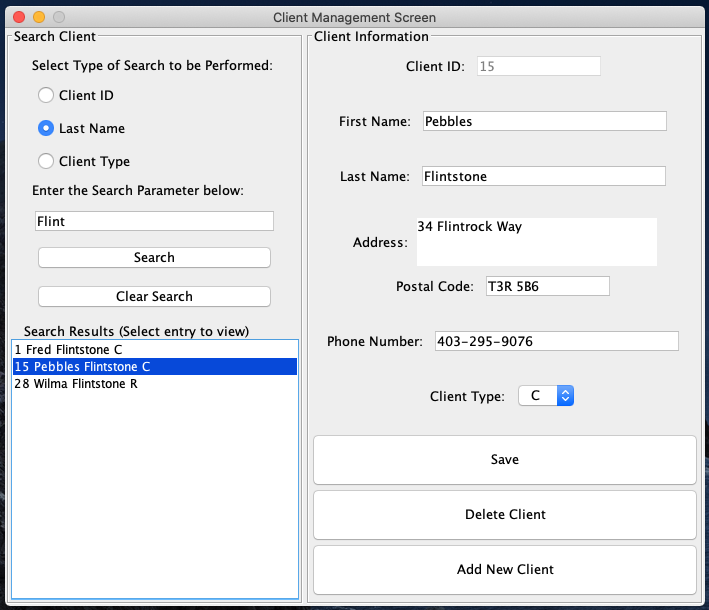

# Customer Database Management Tool

Customer DB Tool built using Java, the Swing Library (GUI) and the JDBC API (for SQL queries) - following the MVC design pattern. The Data is stored in a MySQL Database. Supported capabilities:

* Add Customer
* Search for Customer
* Update Customer
* Delete Customer

## Tools 

* Java / Swing Library
* Java Database Connection (JDBC)
* MySQL

## Screenshot



## Getting Started

These instructions will get you a copy of the project up and running on your local machine for development and testing purposes. 

### Prerequisites

You will need Java 8.x SDK or more recent, as well as MySQL 8.0+

### Installing

A step by step series of examples that tell you how to get a development env running

Ensure that you have MySQL installed.

Download all src (`.java`) files into a folder.

In `CMSModel.java`, modify the following variables to fit your configuration

`tableName`, `databaseName`, `login`, `password` (For MySQL)

Open a shell on the machine you wish to compile on.
Change directory (cd) to the directory that contains the source file(s) (`.java`) that you want to compile.
Enter the following command:

```
javac *.java
```

Ensure that `.class` files have been created for all files, then enter the following to run.

```
java CMSApp
```

## License / Copyright

* This project is licensed under the MIT License.

